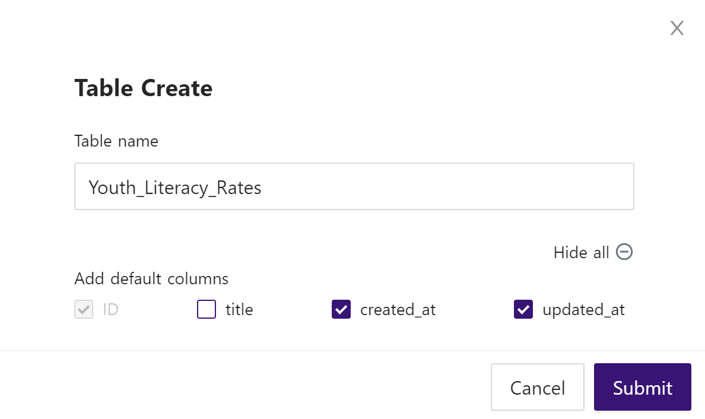

# Upload Files to NocoDB with Python

[NocoDB](https://www.nocodb.com/) is an open-source, no-code platform that turns any database into a smart spreadsheet. 

If you're familiar with Airtable, it's similar to that, but open-source. Yay! 🎉

This is a quick tutorial for uploading a .csv file onto NocoDB using a Python script. Let's get started:

### Prerequisites:

- Docker or Node.js ( > v14.x )
- Python3
- Pip3

### Dev Dependencies:
(listed in requirements.txt)
- python-dotenv
- pandas
- requests

### Dataset:

- [Youth & Adult Literacy Rates .csv file, downloaded and unzipped from Kaggle](https://www.kaggle.com/datasets/thedevastator/youth-adult-literacy-rates-in-2019) or dataset of your choice. I named this example `literacy_rates.csv` and moved it into my working directory.

## Launch a local intance of NocoDB:

First, clone the NocoDB repo:
```
git clone https://github.com/nocodb/nocodb
```
`cd` into docker-compose directory for your database of choice (I used postgres):
```
# for MySQL
cd nocodb/docker-compose/mysql
# for PostgreSQL
cd nocodb/docker-compose/pg
# for MSSQL
cd nocodb/docker-compose/mssql
```
Start running the container in the background:
```
docker-compose up -d
```
## Create Table in NocoDB UI:
Log into the NocoDB UI for your local instance here: http://localhost:8080/dashboard

Create a Project, then create a Table. 

The Table will contain the data for `literacy_rates.csv` or any file that you use. When creating a Table, you can expand for more details and select default columns, as pictured below. In my case, `title` was not necessary, but I always recommend `created_at` and `updated_at` columns in any dataset. 

In this example, the [primary key](https://docs.nocodb.com/setup-and-usages/primary-key) `Id` is set using the index of the pandas data frame, so that if you run the script again, it will return a `Bad Request` error and not double-upload rows.



In your table, use the UI to add your datasets columns and respective data types. For `literacy_rates.csv`, here are the columns, and their data types:

- Region, `SingleLineText`
- Country, `SingleLineText`
- Year, `Year`
- Age, `SingleLineText`
- Literacy rate, `Decimal`

**IMPORTANT: Tables are case-sensitive, make sure that your columns are accurately named as they are in your data file.**

## Retrieve Auth Token and Build .env:
Click on your Project name in the NocoDB UI and select 'Copy Auth Token`.

**IMPORANT: The Auth Token expires every 10 hours, so you will need to get a new one. [Learn how you can change the token expiration here.](https://docs.nocodb.com/developer-resources/accessing-apis)**

Next, build your .env file with the following values:

```
nocodb_auth_token=<your auth token>
nocodb_url=http://localhost:8080
nocodb_project_name=<your project name>
nocodb_table_name=<your table name>
nocodb_org_name=noco
nocodb_upload_file_path=./literacy_rates.csv (or other file)
nocodb_upload_file_chunk_size=1000000
```

## Run Python Script

```
pip3 install -r requirements.txt
python3 upload_nocodb.py
```

Finally, verify the upload in the NocoDB UI! 🎉

# Resources

- [NocoDB Rest API Docs](https://all-apis.nocodb.com/)
- [NocoDB SWAGGER docs](https://docs.nocodb.com/developer-resources/accessing-apis#swagger-ui) 
- [NocoDB Primary Key Docs](https://docs.nocodb.com/setup-and-usages/primary-key/)